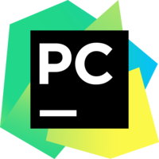

### 极客精神👋

 

Here are some ideas to get you started:

- 🔭 本科南京邮电大学软工程，研究生东南大学网络空间安全
- 🌱 目前研二在读
- 👯 专注于Java、后端开发，目前是栈菜鸟工程师
- 📫 博客：http://www.ffrankfeng.top/

<!--      -->
  

<!-- 

  

 -->

<h2></h2>

 &nbsp;&nbsp;&nbsp;&nbsp;

<!-- stackoverflow profile
-->

**Languages and Frameworks**

<code></code>
<code></code>
<code></code>
<code></code>
<code></code>

**Tools and Environments**

<code></code>
<code></code>
<code></code>
<code></code>
<code></code>
<code></code>
<code></code>
 
